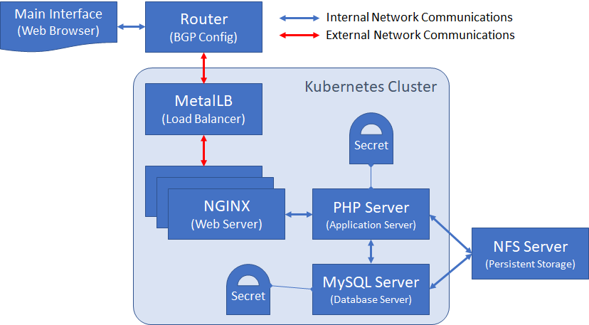
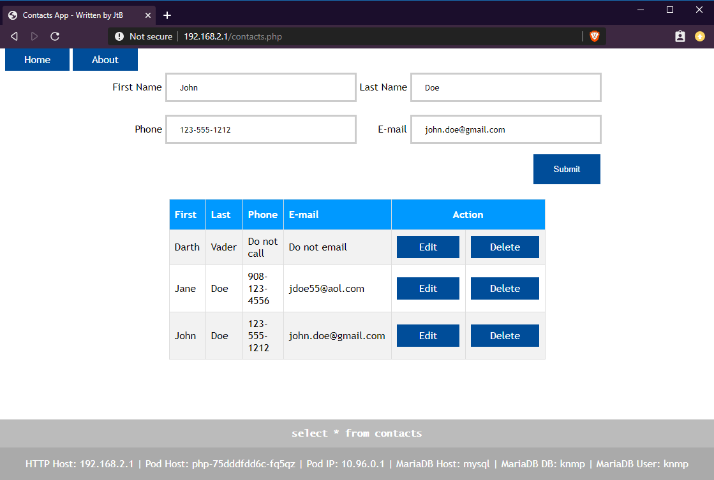

# KNMP
**K**ubernetes **N**GINX **M**ySQL **P**HP (LAMP equivalent)

I created this to learn and demonstrate Kubernetes. I've tried to incorporate many kubernetes features including deployments, configmaps, secrets, services, load balancer, persistent volumes (via NFS) and more.  This is designed to run on-premises.  I've tested this in several environments (kubeadm, Rancher, bare metal the hard way, GKE, and EKS).  I also have a version that runs on Raspberry Pi's.  For that, you'll have to use MariaDB ARM container image (mysql_deployment.yaml) instead of MySQL.  I will continue to expand this to include more features.

The app is a very simple contacts editor. It allows you to view, create, and edit simple contact information. The front-end is a multi-pod load-balanced NGINX web server. The load balancer is MetalLB. The app is written in PHP. The database is MySQL. All files are hosted on a NFS server using persistent volumes, including the PHP code and the MySQL database. Passwords are stored in secrets.

## ToDo's:
- [ ] Re-create in it's own namespace. Include MetalLB in this so that MetalLB can be used independently for other applications
- [ ] Create CI/CD pipeline
- [ ] Automatically create the database/table if they doesn't exist.  Good for new deployments and demos
- [ ] Incorporate a function service ([OpenFaas](https://github.com/openfaas/faas)) into this as well.  Exposes the add/edit/delete as API web services.
- [x] Put PHP source code in github - placed in private repository [tenbosch/knmp_code](https://github.com/tenbosch/knmp_code)
- [x] Put config code in github - placed in private repository [tenbosch/knmp_config](https://github.com/tenbosch/knmp_config)

## Database Details
- DB Name: knmp
- Table Name: contacts
- Table description:

| Field | Type | Null | Key | Default | Extra |
|--|--|--|--|--|--|
| contact_id | int | NO | PRI | NULL | auto_increment |
| first | varchar(50) | YES | | NULL |
| last | varchar(50) | YES | | NULL |
| phone | varchar(15) | YES | | NULL |
| email | varchar (50) | YES | | NULL |


SQL Statement to create table
```
CREATE DATABASE knmp;
USE knmp;
CREATE TABLE contacts (
    contact_id int NOT NULL AUTO_INCREMENT,
    first varchar(50),
    last varchar(50),
    phone varchar(15),
    email varchar(50),
    PRIMARY KEY (contact_id)
);
```

## Custom Docker Container for PHP 
This is hosted on Docker Hub under tenbosch/php-pdo

***Dockerfile***
```
FROM php:7-fpm
RUN docker-php-ext-install pdo_mysql
CMD ["php-fpm"]
EXPOSE 9000
```

## Unifi configuration details
The application uses a load balancer which interacts with the Unifi router via BGP.  Below are the steps to run on the router in order to setup BGP
```
$ ssh admin@192.168.1.1
$ configure
$ set protocols bgp 64512 parameters router-id 192.168.1.1
$ set protocols bgp 64512 neighbor 192.168.1.236 remote-as 64512
$ set protocols bgp 64512 neighbor 192.168.1.237 remote-as 64512
$ set protocols bgp 64512 neighbor 192.168.1.238 remote-as 64512
$ commit
$ save
$ show ip bgp #Run this after if MetalLB has been deployed
$ exit
```

## Description of configuration files

| Files | Description |
|--|--|
| metallb.yaml | MetalLB is a simple bare metal load balancer for Kubernetes.  This deployment is specific to this application |
| metallb-configmap.yaml | This is the configuration for metallb.  It has the BGP info for communicating to the router |
| mysql-deployment.yaml | This defines the MySQL database pod |
| mysql-service.yaml | This exposes the MySQL DB to the local containers.  It’s only connected to by the PHP server |
| mysql-pv.yaml | This creates the PV for the MySQL database.  The files are exported on NFS (192.168.1.242/data1/mysql |
| mysql-secret.yaml | This defines the password secret for the MySQL database |
| nginx_deployment.yaml | This defines the NGINX web server pods.  It spawns 3 replicas of the web server and is load balanced |
| nginx_service_lb.yaml | This is the load balancer service for the NGINX web server.  This requires MetalLB to be installed and configured with a router (Unifi).  It does not require any other service |
| nginx_service.yaml(USE ONLY WITHOUT LB) | This exposes the NGINX web server via a standard node port |
| nginx_configmap.yaml | This defines the configuration for the NGINX web server |
| php_deployment.yaml | This defines the php server pod |
| php_service.yaml | This exposes the PHP server to the local containers.  It’s only accessed by the NGINX server |
| php_pv.yaml | This creates the PV for the PHP code.  The files are exported on NFS (192.168.1.242/data1/code) |

## Diagram of the application


## View of the application

